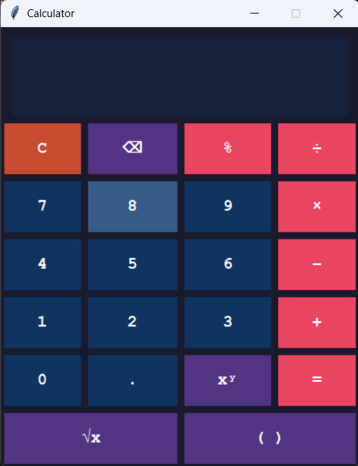

# 🧮 Python GUI Calculator

A simple, clean desktop calculator built with **Python** and **Tkinter** — no extra libraries needed!

---

## ✨ Features

- ➕ Basic Operations — Addition, Subtraction, Multiplication, Division
- 🔢 Power / Exponents — e.g. `2^8 = 256`
- √ Square Root — instant result with the `√x` button
- `%` Modulus — find remainders easily
- ⌫ Backspace — delete the last entered character
- `( )` Smart Parentheses — auto opens/closes brackets
- ⌨️ Keyboard Support — type directly without clicking buttons

---

## 🖥️ Screenshot

> 

---

## 🚀 Getting Started

### Prerequisites

- Python 3.x (Tkinter is included by default)

### Run the App

```bash
python calculator.py
```

No installation needed — just run and go!

---

## 🎮 How to Use

| Button | Action                               |
| ------ | ------------------------------------ |
| `C`    | Clear everything                     |
| `⌫`    | Delete last character                |
| `xʸ`   | Raise to a power (e.g. `2 xʸ 3 = 8`) |
| `√x`   | Square root of current input         |
| `%`    | Modulus / remainder                  |
| `( )`  | Toggle open/close parenthesis        |
| `=`    | Calculate result                     |

### Keyboard Shortcuts

| Key                 | Action                |
| ------------------- | --------------------- |
| `0–9`, `.`          | Enter numbers         |
| `+` `-` `*` `/` `%` | Operators             |
| `^`                 | Power (same as `xʸ`)  |
| `Enter` or `=`      | Evaluate              |
| `Backspace`         | Delete last character |
| `C`                 | Clear                 |

---

## 📁 Project Structure

```
calculator/
│
├── calculator.py   # Main application file
└── README.md       # Project documentation
```

---

## 🛠️ Built With

- [Python 3](https://www.python.org/) — Programming language
- [Tkinter](https://docs.python.org/3/library/tkinter.html) — Built-in GUI library
- [math](https://docs.python.org/3/library/math.html) — Standard library for square root

---

## 📌 Notes

- The calculator uses Python's built-in `eval()` with restricted `__builtins__` for safe expression evaluation.
- No third-party packages are required — works out of the box with any standard Python 3 installation.

---

## 📄 License

This project is open source and available under the [MIT License](LICENSE).
